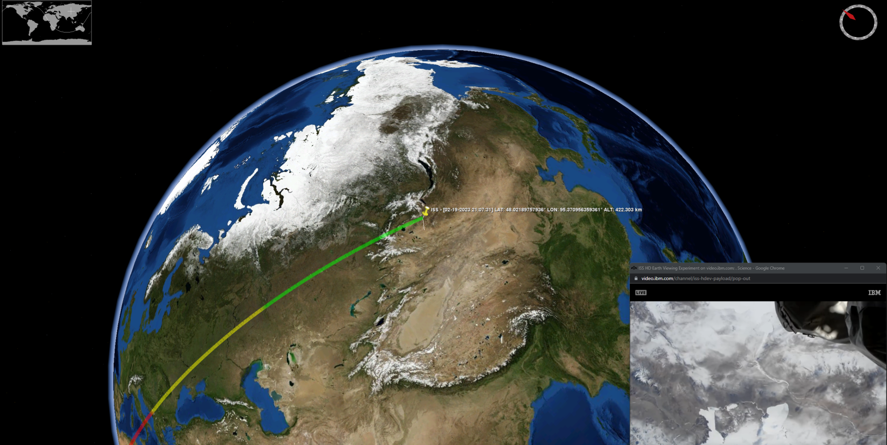
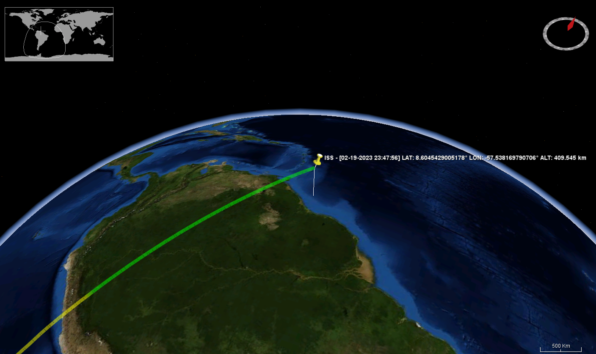
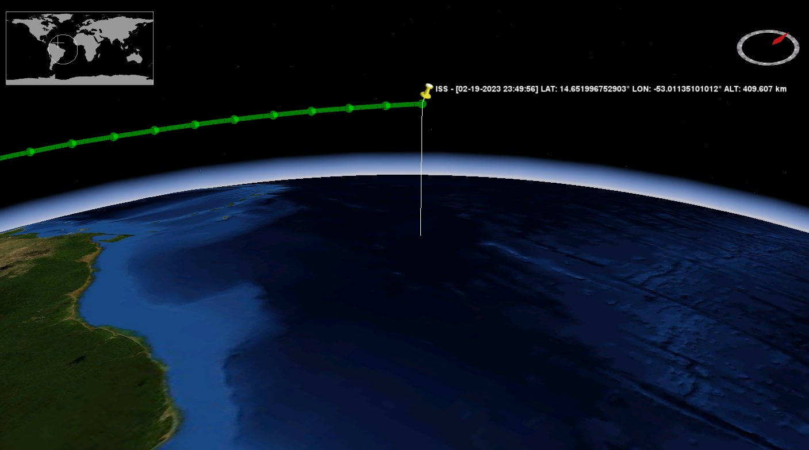

# ISSTracker
A Java Swing application using WorldWind to visually &amp; continuously show the location 
of the International Space Station (ISS).

The project started from the inspiration of openAl's chatGPT after asking the following question:
```
Write a program in Java that uses NASA WorldWind to show me the location of the ISS.
```

Incredibly, chatGPT "wrote" a very limited Java application that did just that, but it was very limited and buggy. 
Since I now had a head start, I decided to pursue this project further! After working on this for a couple of days,
we now have a cool Java Swing application that shows the ISS position every (future configurable) 15 seconds. We are
also drawing a "ground track" `Path` (could be interpreted as an orbit track) using the provided ISS altitude as 
the elevation of the constructed `Position`.

This continues to be a work on progress. Pull requests are welcome! 
Thank you

### Screenshots

***

***

